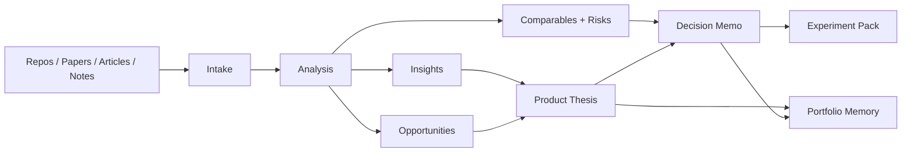
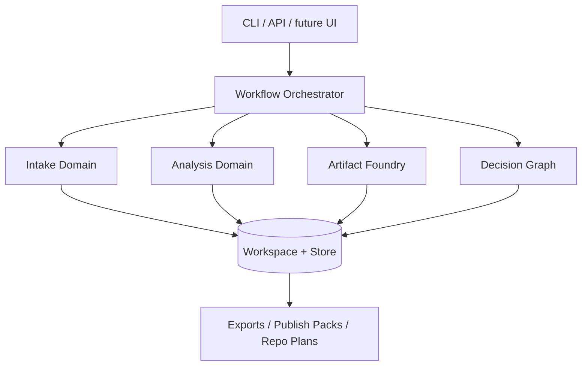

# SignalForge

**Research in. Direction out.**

SignalForge is an open-source product direction engine for builders who ingest too much signal and refuse to build blindly.
It turns repositories, papers, articles, market observations, and founder notes into **decision-grade strategic artifacts**: insights, opportunity evaluations, product theses, decision memos, experiment packs, and portfolio maps.

SignalForge is not a chat wrapper, a note app, or a backlog manager.
It is the operating layer between raw input and committed execution.

## Why SignalForge exists
Builders are surrounded by promising fragments:
- an interesting GitHub repo
- a research paper with one powerful primitive
- an article that reveals a market shift
- scattered founder notes about something worth building

The hard part is not collecting those signals.
The hard part is turning them into a coherent product direction with explicit tradeoffs and durable memory.

That is what SignalForge is for.

## Core outcome


## What SignalForge produces
- canonical source briefs
- insight memos
- opportunity evaluations
- product theses
- decision memos
- experiment packs
- portfolio review artifacts

## Product principles
- **artifact-first** rather than conversation-first
- **portfolio memory** rather than isolated runs
- **decision lineage** rather than recommendation theater
- **local-first core** for sensitive builder material
- **markdown + JSON dual surface** for human review and machine reliability

## Commanded system
SignalForge is designed as a deliberate operating system, not an ambiguous prompt box.

```bash
forge intake add https://github.com/example/repo --type repo --workspace signalforge-lab
forge analyze compare --source src_repo_001 --source src_paper_004 --source src_note_002
forge thesis create --source src_repo_001 --source src_paper_004 --title "Strategic builder memory engine"
forge evidence audit thesis_signalforge-001 --workspace signalforge-lab
forge decide evaluate thesis_signalforge-001 --explain
forge decide commit thesis_signalforge-001 --decision build
forge portfolio review --workspace signalforge-lab
forge portfolio rebalance --workspace signalforge-lab
```

## Architecture


## Repository map
```text
signalforge/
├── README.md
├── pyproject.toml
├── docs/
│   ├── architecture.md
│   ├── artifact-schemas.md
│   ├── command-contracts.md
│   ├── decision-evaluation.md
│   ├── decision-graph.md
│   ├── portfolio-review.md
│   ├── publish-pack.md
│   └── workspace-model.md
├── src/signalforge/
│   ├── cli/
│   ├── domains/
│   ├── models/
│   ├── renderers/
│   └── workflows/
└── examples/
```

## Documentation
- `docs/architecture.md` — system domains and flow
- `docs/artifact-schemas.md` — typed artifact chain across markdown and JSON
- `docs/command-contracts.md` — CLI contract and artifact outputs
- `docs/decision-evaluation.md` — scorecards, confidence, posture rules, and review horizons
- `docs/decision-graph.md` — state transitions, evidence bundles, and portfolio causality
- `docs/evidence-freshness.md` — trust dimensions, freshness audits, and revisit triggers
- `docs/portfolio-review.md` — review lanes, drift taxonomy, and portfolio attention logic
- `docs/publish-pack.md` — controlled transformation from private strategy to public repo surface
- `docs/workspace-model.md` — workspace topology and strategic memory shape

## Open-source posture
The open-source repository should expose the product architecture, schemas, examples, and operating model.
Sensitive founder material and private strategic history remain local.

## Product direction
SignalForge is being shaped as a coherent strategic system from the beginning:
- intake fabric for heterogeneous sources
- strategic analysis engine for extraction, comparison, scoring, and synthesis
- evidence freshness layer for trust, convergence, contradiction, and revisit timing
- artifact foundry for durable outputs
- decision graph for rationale and state transitions
- execution bridge for repo plans, issue packs, and launch materials

## Public presence system
SignalForge is also designed to convert internal direction into a public product surface through curated publish packs.
That gives the system a clean bridge from private strategic work to open-source documentation, example artifacts, and launch narrative.

## Category claim
SignalForge is the **product direction layer** for solo builders, open-source strategists, and agent-native teams.

## Status
Repository scaffold established locally with a working CLI artifact flow for intake, analysis, thesis formation, decision commits, execution packs, evidence audits, portfolio review, portfolio rebalance, and public export surfaces.
