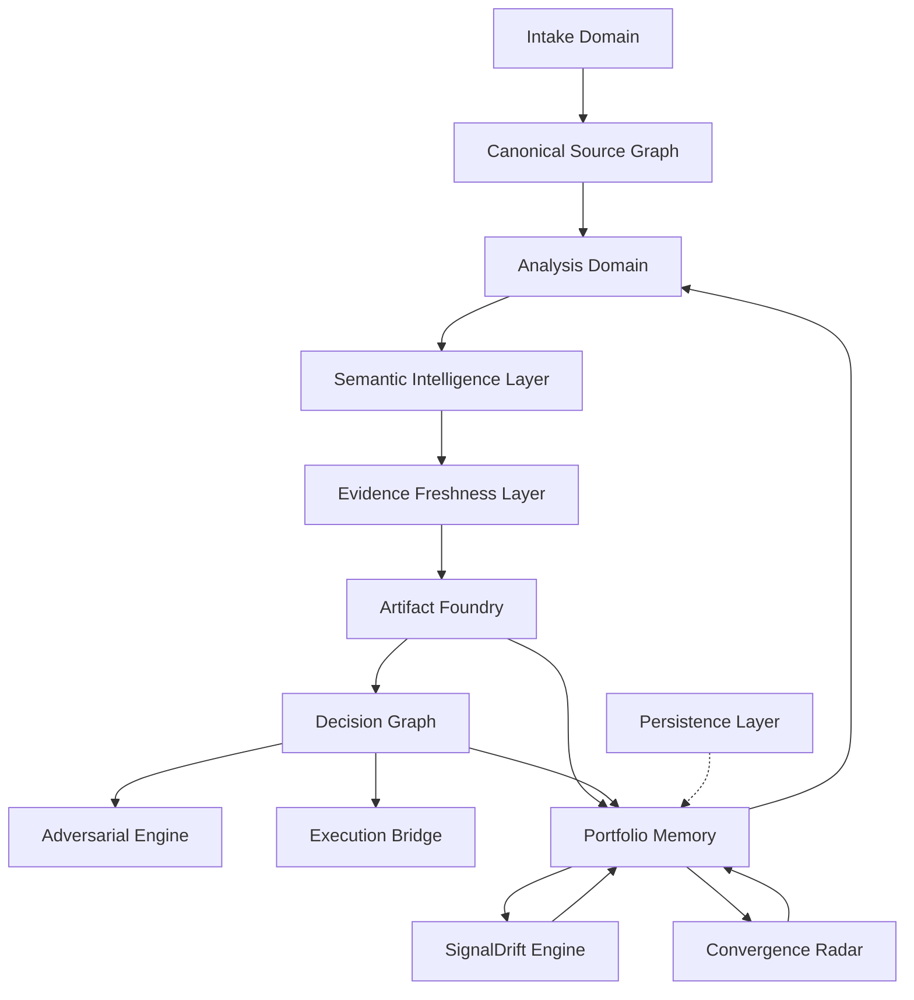
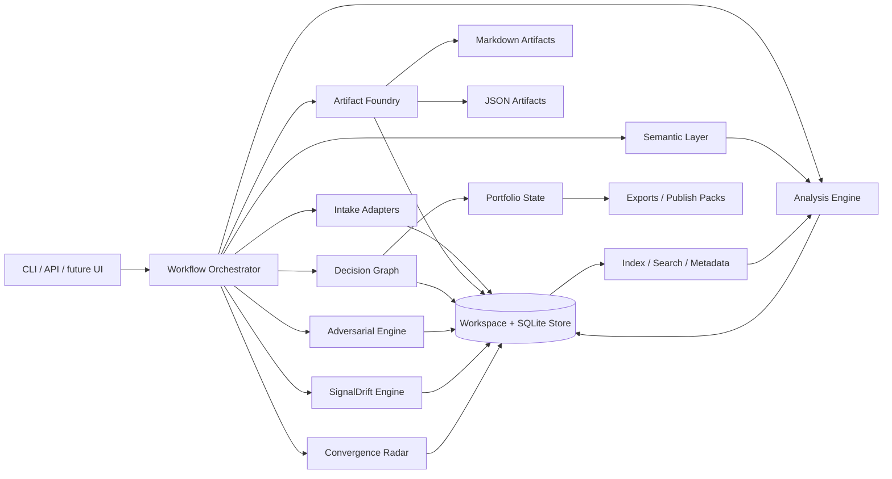

# Architecture

## Product stance
SignalForge is a decision-grade product direction system.
It transforms heterogeneous inputs into linked strategic artifacts, explicit decisions, and a persistent portfolio memory.

## System domains

## Domain responsibilities

### 1. Intake domain
Turns messy source material into stable internal objects.

**Responsibilities**
- fetch or accept raw material
- fingerprint sources
- classify type and confidence
- extract source metadata
- preserve provenance
- create canonical source records

**Subsystems**
- repo intake
- paper intake
- article intake
- note intake
- market observation intake

### 2. Analysis domain
Performs strategic interpretation rather than superficial summarization.

**Responsibilities**
- extract claims and capabilities
- identify reusable primitives
- map comparable tools or categories
- detect overlap, crowding, and white space
- score opportunity quality
- synthesize direction candidates

### 3. Semantic intelligence layer
Adds LLM-powered deep understanding on top of deterministic analysis.
Gracefully degrades to heuristic-only mode when no provider is configured.

**Responsibilities**
- deep source enrichment (strategic summary, extracted signals, domain classification, capability map)
- cross-source synthesis (conceptual overlap, hidden connections, divergence points)
- contradiction detection at logic and assumption level
- whitespace discovery with entry wedges and strategic wedge identification
- confidence calibration (LLM reviews deterministic scores against actual content)
- evidence chain extraction (argument structure: claims, evidence, assumptions, implications)

**Design principle**
Every semantic function returns None when no LLM is available, and the system falls back to deterministic-only output seamlessly. The semantic layer enriches analysis but never replaces it.

**Configuration**
- provider: openai (or any OpenAI-compatible endpoint)
- environment variables: SF_SEMANTIC_PROVIDER, SF_SEMANTIC_API_KEY, SF_SEMANTIC_BASE_URL, SF_SEMANTIC_MODEL
- zero config = deterministic-only mode

### 4. Evidence freshness layer
Tracks whether evidence is still alive enough to justify confidence.

**Responsibilities**
- audit source recency and provenance quality
- detect contradiction density and thin evidence bundles
- preserve hard triggers and soft triggers for revisit timing
- feed bundle health into decision evaluation and portfolio review

### 5. Artifact foundry
Converts analysis outputs into durable strategic artifacts.

**Primary artifacts**
- source brief
- insight memo
- opportunity evaluation
- product thesis
- decision memo
- experiment pack
- portfolio review

### 6. Decision graph
Maintains state transitions and rationale.

**Responsibilities**
- promote, combine, incubate, watch, or reject theses
- capture why a decision was made
- preserve evidence references
- record review windows
- surface drift over time

### 7. Adversarial engine
Acts as a persistent strategic adversary that actively challenges thesis quality.
The first automated system that fights confirmation bias instead of amplifying it.

**Responsibilities**
- build the strongest possible counter-argument against each thesis (red team)
- generate and monitor explicit kill criteria (thesis kill switch)
- detect confirmation bias patterns: evidence asymmetry, anchoring, motivated reasoning
- run portfolio stress tests for simultaneous collapse risk and groupthink
- classify thesis adversarial health: green, yellow, orange, red

**Subsystems**
- RedTeamBuilder: steel-man opposition, load-bearing assumptions, failure modes, vulnerability scoring
- KillCriteriaGenerator / KillCriteriaMonitor: auto-generated kill conditions from thesis structure
- BiasTracker: evidence asymmetry detection, anchoring detection, motivated reasoning detection, portfolio groupthink audit
- AdversarialEngine: orchestrates full audit workflow per thesis and across portfolio

**Design principle**
The adversarial engine runs alongside the main analysis pipeline. It can operate deterministically without LLM, producing heuristic-based adversarial analysis. With LLM, it produces deeper, evidence-backed counter-arguments.

### 8. SignalDrift engine
Tracks how strategic signals evolve over time.
Every signal becomes a living entity with velocity, acceleration, and momentum.

**Responsibilities**
- record multi-dimensional score snapshots over time
- compute velocity (rate of change per score dimension per day)
- compute acceleration (is change speeding up or slowing down)
- compute momentum (strength times velocity)
- compute volatility (how noisy or unstable the signal is)
- classify signal phase: emerging, strengthening, stable, decaying, dormant, volatile
- detect cross-signal divergence (when two theses are moving in opposite directions)

**Design principle**
Just like quantitative finance tracks price velocity and momentum for assets, SignalForge tracks score velocity and momentum for strategic signals. Instead of snapshots, you get trajectories. Instead of scores, you get motion vectors.

### 9. Convergence radar
Detects when signals from different domains converge toward the same opportunity space.

**Responsibilities**
- compute multi-dimensional overlap between thesis pairs
- find convergence clusters (groups of theses with high mutual overlap)
- classify convergence type: complementary, competing, orthogonal, synergistic
- detect emergent opportunities (when convergence plus drift suggest a new space)
- rate signal strength: supersignal (4+ theses), strong (3+), moderate (2+), weak

**Design principle**
Convergence is the strongest signal type because it means multiple independent lines of evidence are pointing at the same conclusion. When 3 or more signals converge, that is a super-signal worth 10x more than any individual signal.

### 10. Execution bridge
Turns selected directions into operational next moves.

**Outputs**
- repo plans
- issue trees
- implementation briefs
- launch narratives
- publish packs

### 11. Portfolio review system
Turns accumulated thesis history into attention allocation, lane assignments, and drift detection.

**Responsibilities**
- classify theses into operating lanes
- generate review packets and drift records
- identify merge candidates and decommission candidates
- rebalance focus across the portfolio
- trigger revisits and fresh commitments

### 12. Persistence layer
Provides durable SQLite storage for all engine outputs.

**Responsibilities**
- store signal snapshots with time-series indexing
- store portfolio reports with workspace partitioning
- store convergence events with signal strength tracking
- support WAL journal mode for concurrent access
- provide auto-cleanup of aged data

**Default location**: ~/.signalforge/signalforge.db

## Architecture map

## Core design decisions

### Typed artifacts with dual surfaces
Every strategic object should exist in:
- **markdown** for human review and editing
- **JSON** for deterministic automation and agent interoperability

### Commanded workflows over chat drift
SignalForge should begin as an explicit command system.
Trust comes from reproducible operations and inspectable outputs.

### Graceful degradation
Every engine that uses LLM must degrade gracefully to deterministic-only mode.
The semantic layer, adversarial engine, and all enrichment functions return None or heuristic results when no provider is configured.

### Workspace as product surface
The workspace is not just storage.
It is the strategic memory layer that makes direction compound over time.

### Temporal awareness
The drift engine ensures that no strategic judgment is treated as permanently valid.
Every score is a point in time, and trajectories matter more than snapshots.

## Foundational build sequence
1. canonical source model
2. artifact schemas
3. workspace writer + renderer
4. workflow orchestrator
5. comparative analysis and scoring
6. decision graph and portfolio review
7. semantic intelligence layer
8. adversarial engine
9. signal drift engine
10. convergence radar
11. persistence layer
12. execution bridge outputs

## Product consequence
SignalForge becomes larger than a one-shot generator.
It becomes a durable operating layer for builders who continuously ingest signals and need a coherent system for turning them into product direction.
The adversarial engine ensures intellectual honesty.
The drift engine ensures temporal awareness.
The convergence radar ensures cross-domain intelligence.
The persistence layer ensures nothing is lost.
