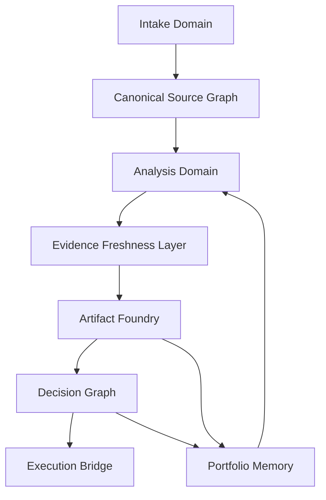
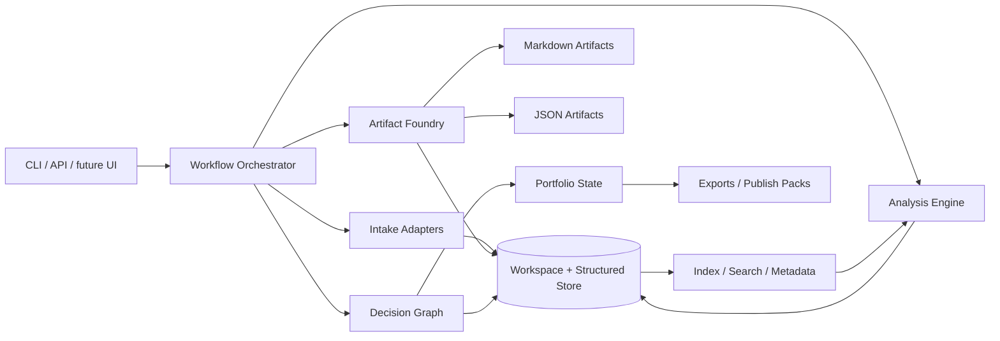

# Architecture

## Product stance
SignalForge is a decision-grade product direction system.
It transforms heterogeneous inputs into linked strategic artifacts, explicit decisions, and a persistent portfolio memory.

## System domains

## Domain responsibilities

### 1. Intake domain
Turns messy source material into stable internal objects.

**Responsibilities**
- fetch or accept raw material
- fingerprint sources
- classify type and confidence
- extract source metadata
- preserve provenance
- create canonical source records

**Subsystems**
- repo intake
- paper intake
- article intake
- note intake
- market observation intake

### 2. Analysis domain
Performs strategic interpretation rather than superficial summarization.

**Responsibilities**
- extract claims and capabilities
- identify reusable primitives
- map comparable tools or categories
- detect overlap, crowding, and white space
- score opportunity quality
- synthesize direction candidates

### 3. Evidence freshness layer
Tracks whether evidence is still alive enough to justify confidence.

**Responsibilities**
- audit source recency and provenance quality
- detect contradiction density and thin evidence bundles
- preserve hard triggers and soft triggers for revisit timing
- feed bundle health into decision evaluation and portfolio review

### 4. Artifact foundry
Converts analysis outputs into durable strategic artifacts.

**Primary artifacts**
- source brief
- insight memo
- opportunity evaluation
- product thesis
- decision memo
- experiment pack
- portfolio review

### 5. Decision graph
Maintains state transitions and rationale.

**Responsibilities**
- promote, combine, incubate, watch, or reject theses
- capture why a decision was made
- preserve evidence references
- record review windows
- surface drift over time

### 6. Execution bridge
Turns selected directions into operational next moves.

**Outputs**
- repo plans
- issue trees
- implementation briefs
- launch narratives
- publish packs

### 7. Portfolio review system
Turns accumulated thesis history into attention allocation, lane assignments, and drift detection.

**Responsibilities**
- classify theses into operating lanes
- generate review packets and drift records
- identify merge candidates and decommission candidates
- rebalance focus across the portfolio
- trigger revisits and fresh commitments

## Architecture map

## Core design decisions

### Typed artifacts with dual surfaces
Every strategic object should exist in:
- **markdown** for human review and editing
- **JSON** for deterministic automation and agent interoperability

### Commanded workflows over chat drift
SignalForge should begin as an explicit command system.
Trust comes from reproducible operations and inspectable outputs.

### Workspace as product surface
The workspace is not just storage.
It is the strategic memory layer that makes direction compound over time.

## Foundational build sequence
1. canonical source model
2. artifact schemas
3. workspace writer + renderer
4. workflow orchestrator
5. comparative analysis and scoring
6. decision graph and portfolio review
7. execution bridge outputs

## Product consequence
SignalForge becomes larger than a one-shot generator.
It becomes a durable operating layer for builders who continuously ingest signals and need a coherent system for turning them into product direction.
