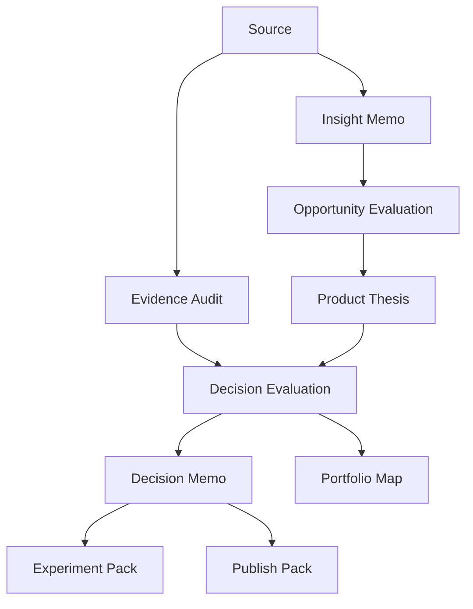

# Artifact Schemas

## Schema philosophy
Every strategic object in SignalForge exists in two synchronized forms:
- **markdown** for human review and editing
- **JSON** for deterministic processing and automation

This gives the product an inspectable builder surface and a dependable agent surface.

## Artifact chain


## Core artifact types

### Source
```json
{
  "id": "src_repo_signalgraph_001",
  "type": "repo",
  "title": "signalgraph",
  "uri": "https://github.com/example/signalgraph",
  "summary": "Graph-native analysis framework for product signals.",
  "captured_at": "2026-04-02T19:00:00Z"
}
```

### Insight memo
```json
{
  "id": "insight_001",
  "source_ids": ["src_repo_signalgraph_001"],
  "core_summary": "The repo is most valuable as a graph primitive rather than a standalone product.",
  "reusable_primitives": ["source graph", "artifact lineage"],
  "confidence": 0.78
}
```

### Evidence audit
```json
{
  "id": "audit_signalforge-001",
  "type": "evidence_audit",
  "target_id": "thesis_signalforge-001",
  "bundle_health": "watch",
  "freshness_score": 0.72,
  "convergence_score": 0.63,
  "convergence_state": "moderate",
  "shared_support_features": ["builder-tooling", "agent-coordination"],
  "cross_type_support_features": ["builder-tooling"],
  "contradiction_score": 0.18,
  "coverage_score": 0.67,
  "source_checks": [
    {
      "source_id": "src_repo_signalgraph_001",
      "freshness": "warm",
      "days_since_capture": 19,
      "provenance_quality": "direct"
    }
  ],
  "review_after": "2026-04-24"
}
```

### Opportunity evaluation
```json
{
  "id": "opp_001",
  "derived_from": ["insight_001"],
  "title": "Decision-graph engine for builders",
  "scores": {
    "novelty": 8.7,
    "urgency": 7.1,
    "founder_fit": 8.8,
    "buildability": 7.9,
    "monetization": 8.0,
    "strategic_leverage": 9.1
  },
  "recommended_motion": "advance"
}
```

### Product thesis
```json
{
  "id": "thesis_signalforge-001",
  "name": "SignalForge",
  "one_line_thesis": "A product direction engine that turns inputs into decision-grade artifacts and a durable product memory.",
  "status": "active"
}
```

### Decision evaluation
```json
{
  "id": "eval_thesis_signalforge-001",
  "type": "decision_evaluation",
  "thesis_id": "thesis_signalforge-001",
  "weighted_score": 8.45,
  "confidence": 0.83,
  "recommended_posture": "build",
  "review_after": "2026-05-20"
}
```

### Decision memo
```json
{
  "id": "decision_build_signalforge-001",
  "thesis_id": "thesis_signalforge-001",
  "evaluation_id": "eval_thesis_signalforge-001",
  "decision": "build",
  "from_state": "active",
  "to_state": "build",
  "review_after": "2026-05-20"
}
```

### Portfolio review
```json
{
  "id": "review_signalforge-lab_2026-04-03",
  "workspace": "signalforge-lab",
  "reviewed_at": "2026-04-03T01:10:00Z",
  "lane_assignments": [
    {
      "thesis_id": "thesis_signalforge-001",
      "lane": "flagship",
      "conviction_score": 8.9,
      "confidence_score": 0.84,
      "attention_delta": "+maintain",
      "reason": "artifact-first decision workflow remains structurally differentiated"
    }
  ],
  "theme_intelligence": {
    "concentration_state": "tilted",
    "merge_candidates": [
      {
        "pair": ["thesis_signalforge-001", "thesis_repo-intelligence-002"],
        "shared_themes": ["builder-tooling", "agent-coordination"],
        "merge_uplift": 0.54
      }
    ],
    "diversification_targets": [
      {
        "theme": "public-narrative",
        "thesis_id": "thesis_launch-surface-003"
      }
    ]
  },
  "drift_alerts": [
    {
      "thesis_id": "thesis_repo-intelligence-002",
      "drift_type": "portfolio_drift",
      "severity": "medium",
      "signal": "overlaps with flagship without enough standalone identity",
      "recommended_action": "merge"
    }
  ],
  "actions": [
    {"action": "revisit", "target_id": "thesis_repo-intelligence-002"},
    {"action": "commit", "target_id": "thesis_signalforge-001"}
  ]
}
```

### Drift alert
```json
{
  "id": "drift_signalforge-001",
  "thesis_id": "thesis_signalforge-001",
  "drift_type": "execution_drift",
  "severity": "medium",
  "signal": "committed direction has weak follow-through in experiment artifacts",
  "recommended_action": "revisit"
}
```

### Publish pack
```json
{
  "id": "publish_pack_001",
  "target": "github_open_source_launch",
  "source_artifacts": ["thesis_signalforge-001", "decision_build_signalforge-001"],
  "narrative_mode": "category-defining"
}
```

## Markdown frontmatter convention
```yaml
---
id: thesis_signalforge-001
type: product_thesis
workspace: signalforge-lab
status: active
source_ids:
  - src_repo_signalgraph_001
updated_at: 2026-04-02T19:00:00Z
---
```

## File naming convention
```text
sources/repo/src_repo_signalgraph_001.md
insights/insight_001.md
opportunities/opp_001.md
theses/thesis_signalforge-001.md
decisions/evaluations/eval_thesis_signalforge-001.md
decisions/decision_build_signalforge-001.md
experiments/exp_public-demo-pack-001.md
portfolio/reviews/review_signalforge-lab_2026-04-03.md
portfolio/drift/drift_signalforge-001.md
decisions/evidence/audit_signalforge-001.md
exports/publish-packs/publish_pack_001/
```

## Design rules
1. Artifact IDs must be stable and referenceable.
2. Every higher-order artifact points back to upstream evidence.
3. Markdown and JSON should describe the same object, not competing versions.
4. Schema evolution must be versioned in `system/schemas/`.
