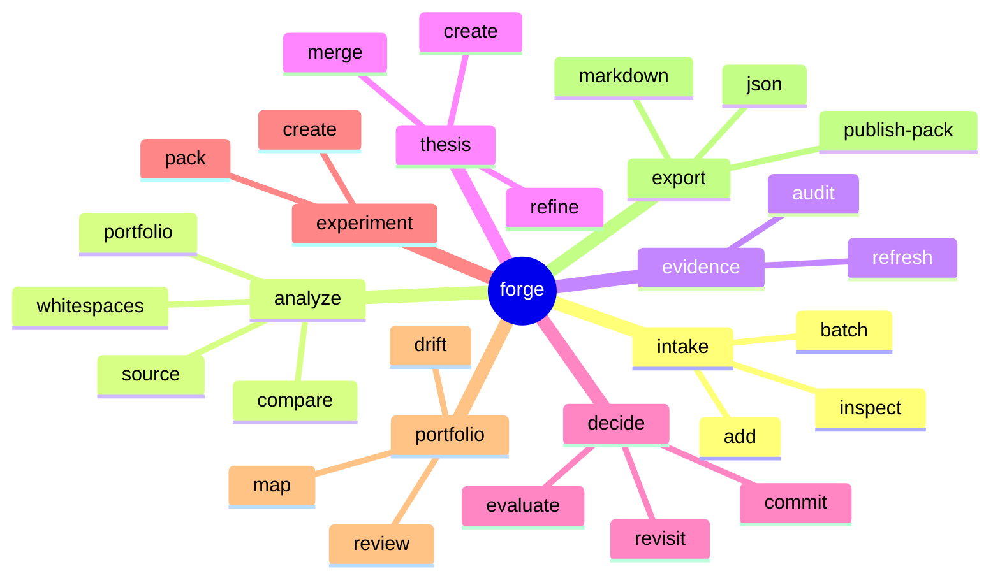
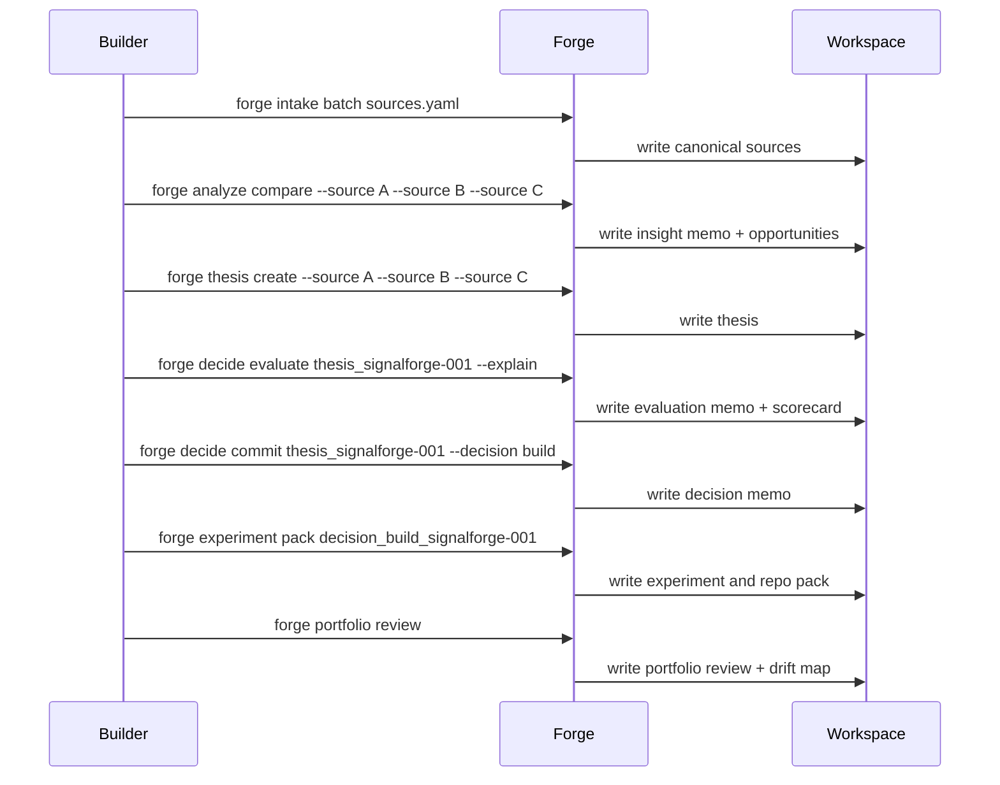

# Command Contracts

## Command philosophy
SignalForge should feel like operating a foundry, not prompting a black box.
Commands are explicit, composable, and artifact-oriented.

## Command map


## Shared flags
```text
--workspace <name>        logical portfolio or operating context
--source <id>             one or more source ids
--artifact <id>           one or more artifact ids
--format md|json|both     output surface
--evidence-mode strict|balanced|exploratory
--write / --no-write      persist outputs or preview only
--explain                 attach rationale and scoring breakdown
```

## Primary contracts

### `forge intake add`
Create one canonical source from a repo URL, paper URL, article URL, or note path.

**Example**
```bash
forge intake add https://github.com/example/project --type repo --workspace signalforge-lab
```

**Writes**
- `sources/<type>/src_*.md`
- `system/index/src_*.json`
- `system/runs/run_*.json`

### `forge analyze compare`
Compare multiple sources and extract overlapping capabilities, strategic wedges, and category patterns.

**Example**
```bash
forge analyze compare --source src_repo_001 --source src_paper_004 --source src_note_002 --workspace signalforge-lab
```

**Writes**
- `insights/insight_compare_*.md`
- `opportunities/opp_*.md`
- optional JSON companions

### `forge evidence audit`
Inspect the vitality of the evidence supporting a thesis or decision bundle.

**Writes**
- `decisions/evidence/audit_*.md`
- `system/index/audit_*.json`
- optional trigger summary in `portfolio/drift/`

**Returns**
- bundle health
- freshness score
- convergence score
- contradiction score
- evidence gaps
- hard triggers
- soft triggers
- recommended review timing

### `forge thesis create`
Generate a named product thesis from sources, insights, or opportunities.

**Example**
```bash
forge thesis create --source src_repo_001 --source src_paper_004 --title "Decision-grade builder memory engine"
```

**Writes**
- `theses/thesis_*.md`
- `system/index/thesis_*.json`

### `forge decide evaluate`
Score a thesis across the decision framework before any final commitment.

**Writes**
- `decisions/evaluations/eval_*.md`
- `system/index/eval_*.json`
- optional evidence-gap report in `portfolio/reviews/`

**Returns**
- weighted score
- confidence
- recommended posture
- dimension scorecard
- review horizon
- evidence gaps

### `forge decide commit`
Record the official state transition for a thesis.

**Decision states**
- build
- incubate
- watch
- combine
- reject

**Writes**
- `decisions/decision_*.md`
- `portfolio/maps/*.md`
- `system/index/decision_*.json`

### `forge experiment pack`
Generate an execution package from a committed decision.

**Outputs**
- experiment brief
- repo plan
- issue tree
- launch hypothesis
- artifact references

### `forge portfolio review`
Produce an updated view of all active directions, their evidence strength, and drift risk.

**Writes**
- `portfolio/reviews/review_*.md`
- `portfolio/drift/drift_*.md`

### `forge portfolio lane`
Explain the current operating lane for a thesis.

**Returns**
- lane classification
- supporting signals
- evidence gaps
- recommended next action

### `forge portfolio rebalance`
Propose how attention and execution energy should shift across the portfolio.

**Returns**
- attention changes by thesis
- merge suggestions
- decommission candidates
- review priorities

### `forge export publish-pack`
Prepare a public-facing bundle from selected internal artifacts.

**Outputs**
- README narrative
- architecture summary
- artifact screenshots or excerpts
- launch copy snippets
- selected example artifacts

## User flow encoded as commands


## Contract rule
A valid SignalForge command should always do at least one of the following:
- create a durable artifact
- update portfolio state
- improve decision clarity
- prepare execution surfaces
