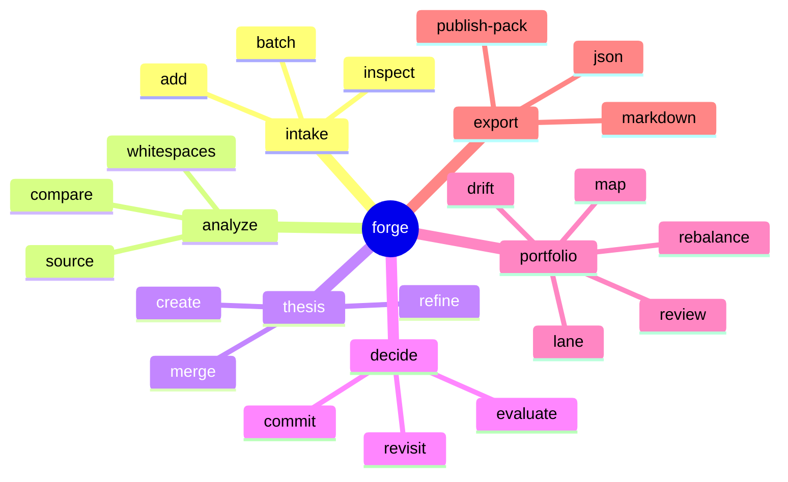

# Command Surface

## Command philosophy
SignalForge should feel like operating a foundry, not prompting a black box.
The command system exists to make strategic work explicit, reproducible, and inspectable.

## Primary command groups

## Why the surface matters
A strong command surface gives SignalForge three structural advantages:
1. reproducibility for serious builders
2. composability for autonomous agents
3. a clean bridge into API and UI layers later without losing product clarity

## Portfolio control commands
The `forge portfolio` namespace is where SignalForge stops behaving like an artifact generator and starts behaving like a strategic operating system.

### `forge portfolio review`
Generate the canonical review packet across all active directions.

### `forge portfolio lane`
Explain why a thesis belongs in `flagship`, `incubation`, `watchtower`, `merge-candidate`, or `decommission`.

### `forge portfolio rebalance`
Recommend how attention and execution energy should move across the portfolio.

### `forge portfolio drift`
Generate explicit drift records with severity, cause, and recommended action.

## Related documents
- `docs/command-contracts.md`
- `docs/portfolio-review.md`
- `docs/decision-graph.md`
