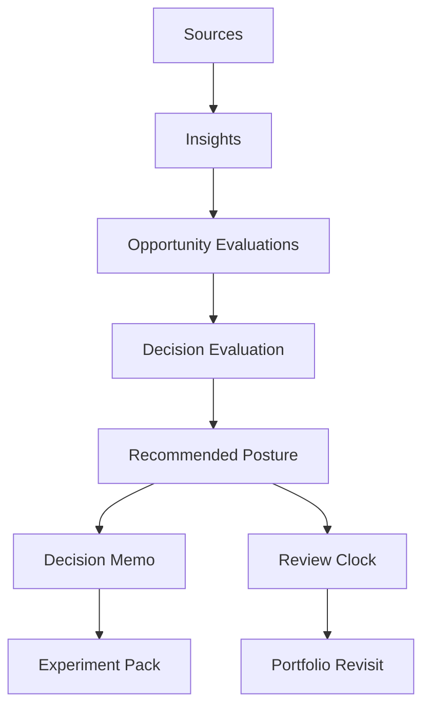
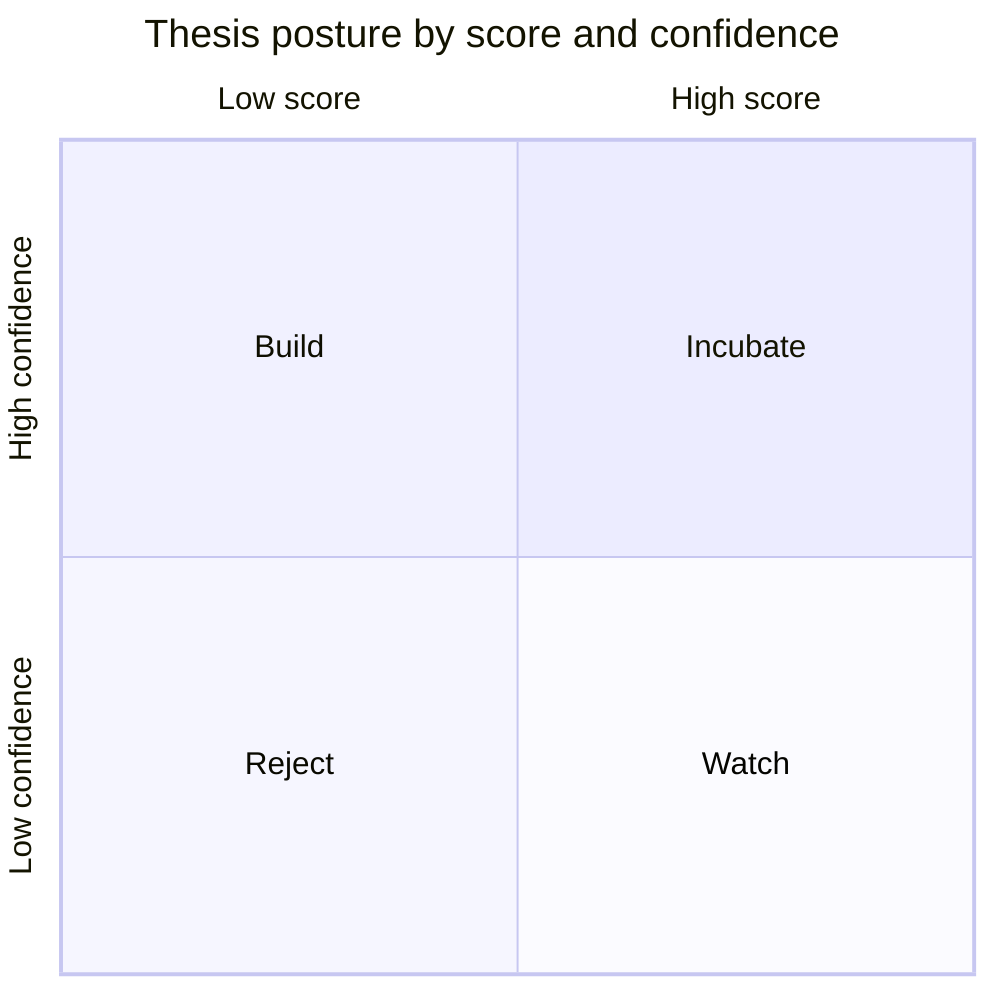

# Decision Evaluation

## Why this layer exists
SignalForge should not move directly from thesis generation to commitment.
It needs a dedicated evaluation layer that converts evidence into a scorecard, a confidence profile, a recommended posture, and a review horizon.

That layer is what makes the system decision-grade rather than stylistically persuasive.

## Evaluation architecture


## Primary dimensions
SignalForge should evaluate every thesis across six dimensions.

| Dimension | Weight | Question |
|---|---:|---|
| Strategic importance | 0.18 | Does the problem matter enough to reshape builder behavior? |
| Differentiation strength | 0.22 | Is there a defendable reason this should exist? |
| Timing quality | 0.14 | Why should this direction matter now? |
| Evidence coherence | 0.20 | Do the inputs converge into one credible wedge? |
| Buildability | 0.16 | Can the system be implemented without collapsing into vagueness? |
| Revenue fit | 0.10 | Does the direction support an open-source-compatible business surface? |

## Evidence bundle contract
A thesis should be evaluated as an explicit evidence bundle.

### Bundle layers
1. source evidence
2. interpretive evidence
3. strategic evidence
4. execution evidence

### Expected contents
- source ids
- insight ids
- opportunity ids
- comparable set ids
- risk records
- prior decision references
- drift indicators

## Score versus confidence
SignalForge should treat score and confidence as distinct values.

- **Score** measures attractiveness.
- **Confidence** measures trust in the current evaluation.

### Confidence drivers
| Driver | Description |
|---|---|
| Source diversity | Different input types align on the same wedge |
| Cross-source agreement | Claims converge rather than conflict |
| Provenance quality | Inputs are recent, attributable, and direct |
| Contradiction density | Conflicting claims lower trust |
| Lineage completeness | Judgments link back to evidence artifacts |

## Posture matrix


## Posture rules
| Posture | Rule | Consequence |
|---|---|---|
| `build` | high score + high confidence | generate decision memo and execution artifacts |
| `incubate` | strong potential + incomplete certainty | gather sharper evidence and refine thesis |
| `watch` | mixed score or unclear timing | schedule a review window and track triggers |
| `combine` | weak standalone identity + strong merge path | attach thesis to a stronger direction |
| `reject` | low score or decayed confidence | preserve rationale and stop active investment |

## Default thresholds
| Condition | Threshold |
|---|---:|
| `build` weighted score floor | >= 8.2 |
| `build` confidence floor | >= 0.78 |
| `incubate` score band | 7.2 - 8.19 |
| `incubate` confidence floor | >= 0.55 |
| `watch` band | 6.0 - 7.19 or timing uncertainty |
| automatic `reject` trigger | < 6.0 or contradiction overload |
| `combine` trigger | differentiation < 7.0 and merge uplift >= 1.0 |

## Command contract
### `forge decide evaluate`
Produce a first-class evaluation artifact before any final commitment.

**Writes**
- `decisions/evaluations/eval_*.md`
- `system/index/eval_*.json`
- optional evidence-gap report in `portfolio/reviews/`

**Returns**
- weighted score
- confidence
- recommended posture
- dimension scorecard
- review horizon
- evidence gaps

## JSON schema shape
```json
{
  "id": "eval_thesis_signalforge-001",
  "type": "decision_evaluation",
  "workspace": "signalforge-lab",
  "thesis_id": "thesis_signalforge-001",
  "evaluated_at": "2026-04-02T22:30:00Z",
  "dimensions": {
    "strategic_importance": {"score": 8.7, "weight": 0.18, "notes": ["signal overload compounds"]},
    "differentiation_strength": {"score": 9.1, "weight": 0.22, "notes": ["artifact-first decision workflow is structurally distinct"]},
    "timing_quality": {"score": 8.0, "weight": 0.14, "notes": ["AI builder inputs are expanding rapidly"]},
    "evidence_coherence": {"score": 8.5, "weight": 0.20, "notes": ["repo, note, and architecture evidence converge"]},
    "buildability": {"score": 7.9, "weight": 0.16, "notes": ["local-first command system is implementable"]},
    "revenue_fit": {"score": 7.8, "weight": 0.10, "notes": ["open core plus team and managed layers is viable"]}
  },
  "weighted_score": 8.45,
  "confidence": 0.83,
  "recommended_posture": "build",
  "evidence_ids": ["opp_decision-layer-001", "insight_multi-source-synthesis-001", "compare_signal_stack-001"],
  "gaps": ["need more collaborative review workflow evidence"],
  "review_after": "2026-05-20",
  "schema_version": "1.0"
}
```

## Markdown rendering shape
```markdown
---
id: eval_thesis_signalforge-001
type: decision_evaluation
thesis_id: thesis_signalforge-001
recommended_posture: build
weighted_score: 8.45
confidence: 0.83
review_after: 2026-05-20
---

# Decision Evaluation — SignalForge

## Verdict
Build

## Why this clears the bar
...

## Dimension scorecard
...

## Gaps before stronger conviction
...
```

## Review windows
| Posture | Review horizon |
|---|---|
| build | 30-45 days |
| incubate | 14-21 days |
| watch | 21-45 days |
| combine | immediate after merge target is chosen |
| reject | 45-90 days if category conditions change |

## Product consequence
This layer makes portfolio review computable and auditable.
SignalForge stops being a thesis generator and becomes a system that can justify commitment, delay, merger, or rejection with explicit structure.
