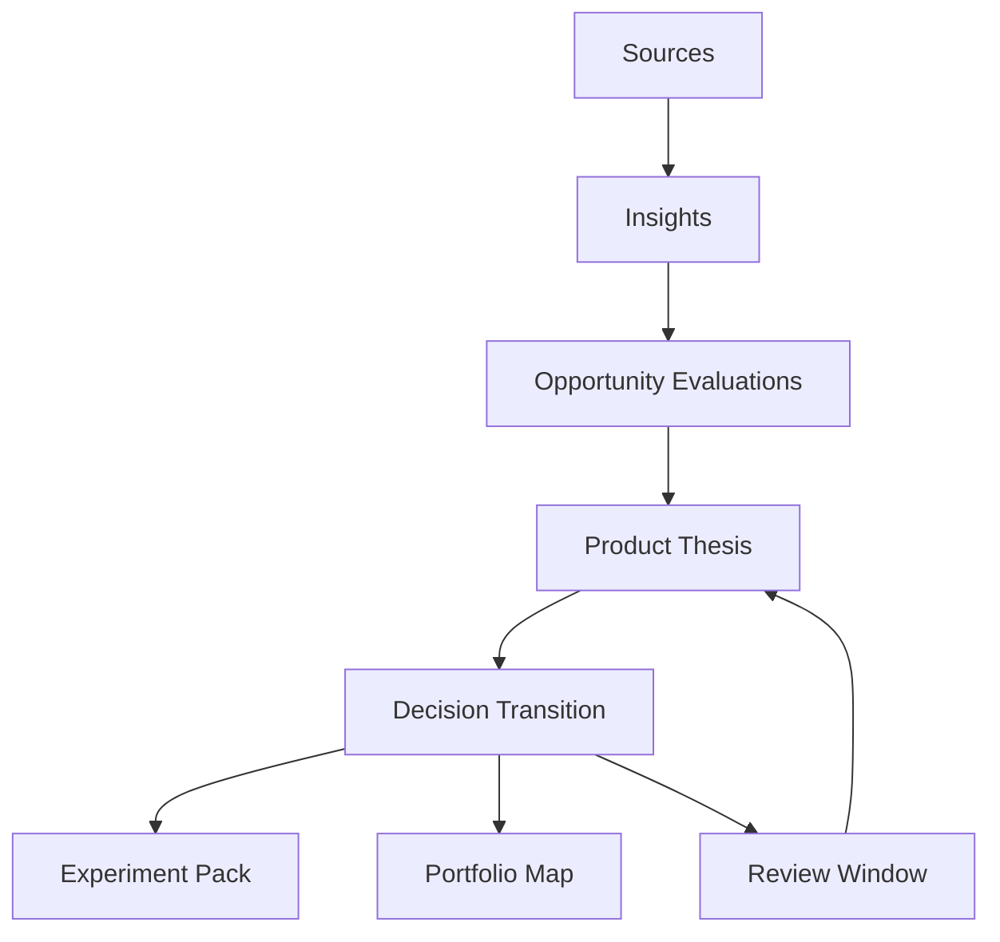
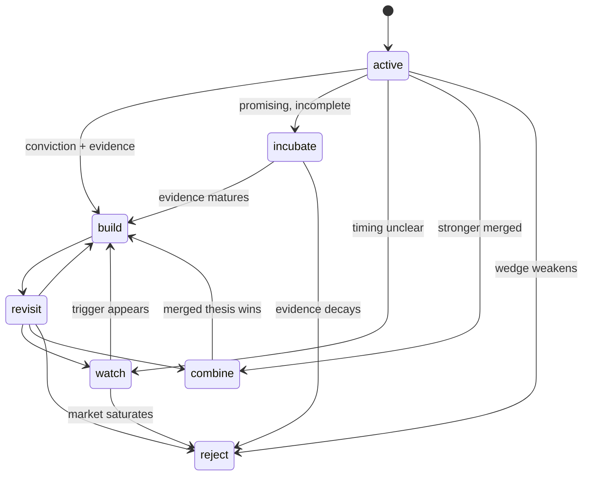

# Decision Graph

## Why the decision graph exists
SignalForge is not finished when it generates a thesis.
The real strategic value appears when the system can show **how a direction moved from possibility to commitment**.

The decision graph is the structure that preserves:
- thesis state transitions
- evidence bundles behind each transition
- execution artifacts spawned from committed decisions
- revisit events when new signals change the landscape

## Product consequence
This turns SignalForge into an auditable direction system instead of recommendation theater.

## Graph overview


## State machine


## Transition contract
Every decision transition should preserve the following fields:

```json
{
  "id": "decision_build_signalforge-001",
  "thesis_id": "thesis_signalforge-001",
  "from_state": "active",
  "to_state": "build",
  "decision": "build",
  "evidence_ids": ["opp_001", "insight_003", "compare_001"],
  "why_now": ["signal overload is compounding", "adjacent tools stop at summarization"],
  "why_not": ["schema discipline is required to avoid vague output"],
  "confidence_before": 0.64,
  "confidence_after": 0.87,
  "review_after": "2026-05-20"
}
```

## Design rules
1. Decisions are explicit transitions, not hidden metadata.
2. Every transition references evidence bundles.
3. A build decision can spawn execution artifacts.
4. Revisit events are first-class because direction changes are normal.
5. Portfolio review reads the graph rather than guessing from flat files.

## Command implications
The graph sharpens the purpose of:
- `forge decide commit`
- `forge decide revisit`
- `forge thesis lineage`
- `forge portfolio map`
- `forge portfolio drift`

## Storage shape
```text
workspace/
├── decisions/
│   ├── decision_build_signalforge-001.md
│   └── decision_watch_agent-ops-002.md
├── portfolio/
│   ├── maps/
│   ├── reviews/
│   └── drift/
└── system/
    ├── index/decision_*.json
    └── lineage/edges.jsonl
```

## Why it differentiates SignalForge
Most adjacent AI tools produce outputs.
SignalForge preserves strategic causality.
That is a stronger and more defensible category claim.
