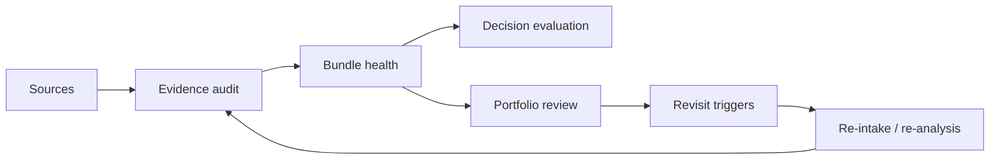
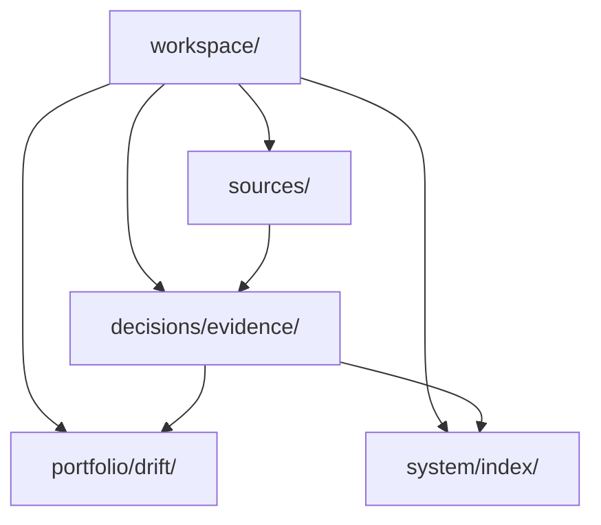

# Evidence Freshness

## Why this layer exists
SignalForge should not treat every source and artifact as equally alive forever.
A decision-grade system needs a dedicated mechanism for tracking whether evidence is recent, convergent, attributable, and still strategically trustworthy.

This layer makes the product capable of preserving not only evidence lineage, but evidence vitality.

## Freshness loop


## Core trust dimensions
| Dimension | Question | Effect |
|---|---|---|
| recency | How old is the source or derivative artifact? | aging evidence lowers timing confidence |
| provenance quality | Is the claim direct, attributable, and inspectable? | weak provenance reduces trust |
| convergence | Do multiple source types support the same wedge with overlapping signals, domain cues, and capability hints? | convergence raises confidence and lowers false-positive enthusiasm |
| contradiction load | Are major claims unresolved or conflicting? | contradiction lowers confidence quickly |
| coverage depth | Does the thesis have enough source, interpretive, strategic, and execution evidence? | thin bundles should not be overcommitted |
| trigger sensitivity | What changes should force a revisit before the next review cycle? | major shifts get escalated immediately |

## Freshness statuses
### Source posture
- `hot` — recent and highly relevant
- `warm` — still useful but approaching review
- `cool` — informative but weakening as a decision anchor
- `stale` — should be refreshed before driving a major commitment

### Bundle posture
- `strong`
- `watch`
- `fragile`
- `expired`

A thesis can score highly on attractiveness while still sitting on a fragile evidence bundle.
That distinction should stay explicit throughout the product.

## Trigger taxonomy
### Hard triggers
Events that should force immediate re-evaluation:
- major competitor launch in the same wedge
- enabling model or platform shift that changes feasibility
- a core source becomes deprecated, disproven, or inaccessible
- a thesis loses differentiation due to category convergence

### Soft triggers
Events that should tighten review timing:
- no fresh market observation for a configured window
- one source type dominates the bundle too heavily
- narrative drift toward generic language
- execution continues while supporting evidence grows old

## Command contracts
### `forge evidence audit`
Inspect the vitality of the evidence supporting a thesis or decision bundle.

**Writes**
- `decisions/evidence/audit_*.md`
- `system/index/audit_*.json`
- optional trigger summary in `portfolio/drift/`

**Returns**
- bundle health
- freshness score
- provenance score
- convergence score
- source diversity score
- average source age
- contradiction score
- evidence gaps
- hard triggers
- soft triggers
- recommended review timing

### `forge evidence refresh`
Re-intake stale sources and re-run affected downstream artifacts.

**Writes**
- `sources/*`
- `insights/*`
- `decisions/evidence/audit_*.md`
- `system/runs/run_*.json`

## JSON schema shape
```json
{
  "id": "audit_signalforge-001",
  "type": "evidence_audit",
  "workspace": "signalforge-lab",
  "target_id": "thesis_signalforge-001",
  "audit_scope": "decision_bundle",
  "bundle_health": "watch",
  "freshness_score": 0.72,
  "provenance_score": 0.81,
  "convergence_score": 0.63,
  "convergence_state": "moderate",
  "shared_support_features": ["builder-tooling", "agent-coordination"],
  "cross_type_support_features": ["builder-tooling", "agent-coordination"],
  "source_diversity_score": 0.75,
  "average_source_age_days": 19,
  "contradiction_score": 0.18,
  "coverage_score": 0.67,
  "source_checks": [
    {
      "source_id": "src_repo_signalgraph_001",
      "freshness": "warm",
      "days_since_capture": 19,
      "provenance_quality": "direct"
    },
    {
      "source_id": "src_note_founder_003",
      "freshness": "hot",
      "days_since_capture": 2,
      "provenance_quality": "direct"
    }
  ],
  "hard_triggers": [
    "new competing product direction engine launches publicly"
  ],
  "soft_triggers": [
    "no fresh market observation for 21 days"
  ],
  "recommended_action": "revisit_soon",
  "review_after": "2026-04-24",
  "schema_version": "1.0"
}
```

## Workspace implication
A strong SignalForge workspace should preserve evidence freshness as a visible layer, not an implicit guess.



## Product consequence
Evidence freshness gives SignalForge a mechanism for knowing when to distrust an old judgment.
That makes the product feel less like a static strategist and more like a living direction engine.
