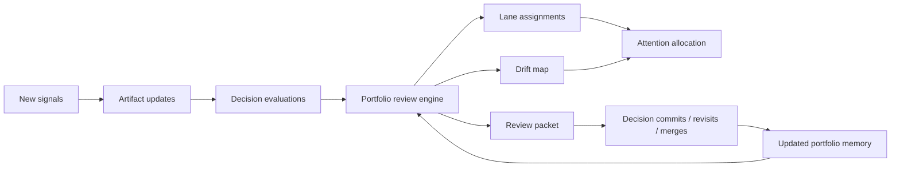
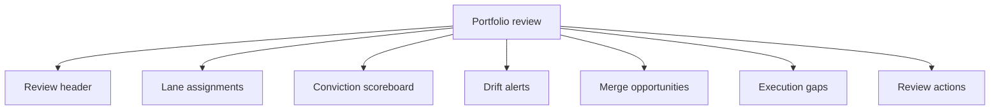

# Portfolio Review

## Why this layer exists
SignalForge should not stop at generating theses and decision memos.
It needs a first-class system for reviewing the entire direction landscape, reallocating attention, and detecting which ideas are strengthening, converging, or decaying.

Portfolio review is the control room of SignalForge.
It turns artifact history into an operating decision about where focus should go next.

## Review loop


## Core review questions
A valid portfolio review should answer:
1. Which thesis is the current flagship?
2. Which theses deserve incubation rather than commitment?
3. Which theses are drifting because the market, evidence, or narrative changed?
4. Which theses should be merged because their standalone differentiation is weak?
5. Which committed directions lack execution follow-through?
6. Which rejected or watchlisted directions deserve re-opening?
7. How should attention shift before the next review window?

## Review lanes
| Lane | Meaning | Typical action |
|---|---|---|
| `flagship` | Highest-conviction direction with active build energy | protect focus and deepen execution |
| `incubation` | Strong possibility with incomplete proof | acquire evidence and sharpen wedge |
| `watchtower` | Timing-sensitive thesis worth monitoring | track triggers and schedule re-evaluation |
| `merge-candidate` | Better as part of another direction | identify merge target and integration logic |
| `decommission` | No longer deserves active investment | preserve rationale and stop new work |

## Review anatomy


## Core signals per thesis
| Signal | Meaning |
|---|---|
| `conviction_score` | Current weighted strategic attractiveness |
| `confidence_score` | Trust in the evidence bundle and lineage |
| `freshness_score` | Whether supporting evidence is still current |
| `provenance_score` | Whether supporting sources are attributable and credible |
| `theme_hhi` | How concentrated the portfolio is around a small theme set |
| `crowding_pressure` | Competitive saturation around the wedge |
| `execution_progress` | Whether commitment produced downstream movement |
| `merge_uplift` | Whether combining with another thesis makes the portfolio stronger |
| `theme_overlap` | How much a thesis is compressed by neighboring theses in the same theme cluster |
| `diversification_targets` | Unique themes that can rebalance the portfolio away from concentration traps |

## Drift taxonomy
### Market drift
The category crowded or shifted and the thesis is less differentiated than before.

### Evidence drift
The evidence bundle became stale, sparse, or contradictory.

### Execution drift
A thesis was committed, but follow-through artifacts are weak or absent.

### Narrative drift
The product claim lost sharpness and now sounds generic.

### Portfolio drift
The thesis may still be valid, but it no longer deserves its current share of attention.

## Command contracts
### `forge portfolio review`
Produce the canonical review packet across all active directions.
Theme concentration, cluster formation, pairwise thesis overlap, merge uplift, and evidence credibility should feed the review packet rather than living as separate diagnostics.

**Writes**
- `portfolio/reviews/review_*.md`
- `portfolio/reviews/review_*.json`
- `portfolio/maps/portfolio_active-*.md`

### `forge portfolio lane`
Explain why a thesis belongs in a specific lane.

**Returns**
- lane classification
- supporting signals
- evidence gaps
- suggested next action

### `forge portfolio drift`
Generate explicit drift records with type, severity, and recommended action.

**Writes**
- `portfolio/drift/drift_*.md`
- `portfolio/drift/drift_*.json`

### `forge portfolio rebalance`
Propose how attention and execution energy should shift across the portfolio.

**Returns**
- attention changes by thesis
- merge suggestions
- decommission candidates
- review priorities

## JSON schema shape
```json
{
  "id": "review_signalforge-lab_2026-04-03",
  "type": "portfolio_review",
  "workspace": "signalforge-lab",
  "reviewed_at": "2026-04-03T01:10:00Z",
  "window": {
    "start": "2026-03-20",
    "end": "2026-04-03"
  },
  "lane_assignments": [
    {
      "thesis_id": "thesis_signalforge-001",
      "lane": "flagship",
      "conviction_score": 8.9,
      "confidence_score": 0.84,
      "attention_delta": "+maintain",
      "reason": "artifact-first decision workflow remains structurally differentiated"
    }
  ],
  "theme_intelligence": {
    "concentration_state": "tilted",
    "merge_candidates": [
      {
        "pair": ["thesis_signalforge-001", "thesis_repo-intelligence-002"],
        "shared_themes": ["builder-tooling", "agent-coordination"],
        "merge_uplift": 0.54,
        "relationship": "adjacent"
      }
    ],
    "diversification_targets": [
      {
        "theme": "public-narrative",
        "thesis_id": "thesis_launch-surface-003"
      }
    ]
  },
  "drift_alerts": [
    {
      "thesis_id": "thesis_repo-intelligence-002",
      "drift_type": "portfolio_drift",
      "severity": "medium",
      "signal": "overlaps with flagship without enough standalone identity",
      "recommended_action": "merge"
    }
  ],
  "execution_gaps": [
    {
      "thesis_id": "thesis_signalforge-001",
      "gap": "publish-pack automation remains under-instrumented"
    }
  ],
  "actions": [
    {
      "action": "revisit",
      "target_id": "thesis_repo-intelligence-002"
    },
    {
      "action": "commit",
      "target_id": "thesis_signalforge-001",
      "decision": "build"
    }
  ],
  "schema_version": "1.0"
}
```

## Markdown rendering shape
```markdown
---
id: review_signalforge-lab_2026-04-03
type: portfolio_review
workspace: signalforge-lab
reviewed_at: 2026-04-03T01:10:00Z
review_window_start: 2026-03-20
review_window_end: 2026-04-03
---

# Portfolio Review — SignalForge Lab

## Executive verdict
SignalForge remains the flagship direction.
Related repo-intelligence directions should be merged into the flagship rather than defended as separate bets.

## Lane assignments
...

## Drift alerts
...

## Required actions before next review window
...
```

## Review rhythm
| Rhythm | Purpose |
|---|---|
| weekly micro-review | detect drift, evidence gaps, and stalled execution |
| biweekly conviction review | update lane assignments and attention allocation |
| monthly strategic review | decide build, merge, watch, or decommission transitions |
| event-triggered review | respond to major new signals or category changes |

## Product consequence
Portfolio review makes SignalForge feel like a strategic operating system instead of a thesis generator.
It gives the product a real mechanism for managing conviction over time.
