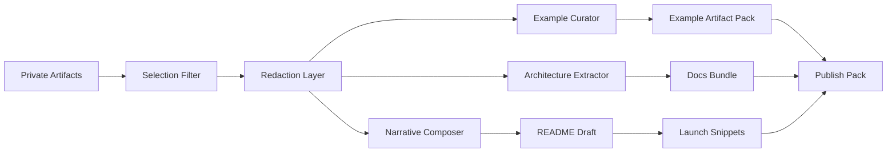

# Publish Pack

## Why publish packs matter
SignalForge should be able to transform private strategy into a public product surface without leaking sensitive workspace material.
A publish pack is the controlled translation layer from:
- internal artifacts
- redaction rules
- public narrative outputs

## Transformation flow


## Outputs
A serious publish pack should contain:
- README narrative
- public architecture brief
- command story
- sanitized example artifacts
- launch copy snippets
- repository metadata suggestions

## Manifest shape
```yaml
id: publish_pack_001
workspace: signalforge-lab
target: github_open_source_launch
narrative_mode: category-defining
source_artifacts:
  - thesis_signalforge-001
  - decision_build_signalforge-001
  - exp_public-demo-pack-001
redaction_policy:
  remove_private_notes: true
  remove_portfolio_references: true
  replace_source_names_with_descriptors: true
outputs:
  - README.md
  - docs/architecture.md
  - docs/command-contracts.md
  - examples/example-artifact-pack/
  - launch/snippets.md
```

## Redaction rules
1. Preserve insight shape, not private identities.
2. Publish representative examples, not raw founder notes.
3. Keep architecture legible while abstracting sensitive internals.
4. Avoid leaking private portfolio logic or unpublished strategy.

## Command implications
The publish-pack concept justifies:
- `forge export publish-pack`
- `forge export markdown`
- `forge export json`
- `forge experiment pack`

## Strategic consequence
SignalForge becomes a direction-to-presence engine, not only a direction engine.
That makes the open-source surface stronger and the commercial path more credible.
