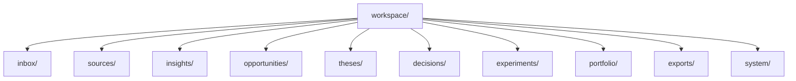
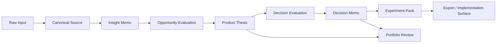

# Workspace Model

## Why the workspace matters
SignalForge should leave behind a strategic workspace, not a pile of disconnected files.
The filesystem is part of the product experience because it encodes memory, provenance, and review rhythm.

## Workspace topology


## Filesystem layout
```text
workspace/
├── inbox/
├── sources/
│   ├── repo/
│   ├── paper/
│   ├── article/
│   ├── note/
│   └── market/
├── insights/
├── opportunities/
├── theses/
├── decisions/
│   ├── evaluations/
│   └── evidence/
├── experiments/
├── portfolio/
│   ├── maps/
│   ├── reviews/
│   └── drift/
├── exports/
│   ├── internal/
│   ├── public/
│   └── publish-packs/
└── system/
    ├── runs/
    ├── index/
    ├── schemas/
    └── manifests/
```

## Lifecycle


## Surface layers

### Builder surface
Markdown artifacts optimized for clarity, linking, and manual refinement.

### Agent surface
Structured JSON artifacts, schema versions, IDs, and deterministic manifests.

### System surface
Run metadata, lineage edges, scores, freshness windows, and machine indexes.
Evidence audits belong here operationally even when they are rendered as readable markdown under `decisions/evidence/`.

## Naming discipline
```text
sources/repo/src_repo_graph-memory-001
insights/insight_multi-source-synthesis-001
opportunities/opp_decision-layer-001
theses/thesis_signalforge-001
decisions/evaluations/eval_signalforge-build-readiness-001
decisions/evidence/audit_signalforge-001
decisions/decision_build_signalforge-001
experiments/exp_public-demo-pack-001
```

## Product consequence
A strong workspace model turns SignalForge from a generator into a strategic operating system.
That is what enables compounding direction over time.
