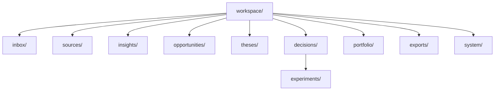
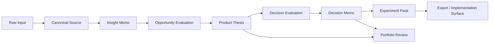

# Workspace Model

## Why the workspace matters
SignalForge should leave behind a strategic workspace, not just storage.
It the filesystem is part of the product experience because it encodes memory, provenance, and review rhythm.

## Workspace topology


## Filesystem layout
```text
workspace/
├── inbox/
├── sources/
│   ├── repo/
│   ├── paper/
│   ├── article/
│   ├── note/
│   └── market/
├── insights/
├── opportunities/
├── theses/
├── decisions/
│   ├── evaluations/
│   └── evidence/
├── experiments/
├── portfolio/
│   ├── maps/
│   ├── reviews/
│   └── drift/
├── exports/
│   ├── internal/
│   ├── public/
│   └── publish-packs/
└── system/
    ├── runs/
    ├── index/
    ├── schemas/
    ├── manifests/
    └── db/
        └── signalforge.db
```

## Lifecycle


## Surface layers

### Builder surface
Markdown artifacts optimized for clarity, linking, and manual refinement.

### Agent surface
Structured JSON artifacts, schema versions, IDs, and deterministic manifests.

### System surface
Run metadata, lineage edges, scores, freshness windows, and machine indexes.
Evidence audits belong here operationally even when they are rendered as readable markdown under `decisions/evidence/`.

### Persistence surface
SQLite database storing snapshots time-series, portfolio reports history, and convergence events logs.
Enables durable queries across workspace partitionsed data.

## Semantic enrichment
Every source and artifact can optionally receive LLM-powered deep enrichment when a semantic layer is enabled. This enrichment adds strategic summaries, extracted signals, domain classification, capability map, opportunity hints, risk indicators, and freshness assessment to the source payload without replacing deterministic analysis.

 When disabled, all outputs remains deterministic-only.

 this gives SignalForge a dual dual intelligence system: deterministic analysis as the surface plus LLM-powered deep understanding.

 Evidence chain extraction adds argument structure to the source, not just keywords analysis.

### Adversarial enrichment
Every thesis receives adversarial audit, red team analysis, and bias detection. Status is green/yellow/orange/red with explicit kill criteria monitoring.

### Drift enrichment
Every thesis generates signal snapshots tracked over time with velocity, acceleration, momentum, and volatility computation.

### Convergence enrichment
The portfolio is scanned for convergence patterns across theses with pairwise overlap detection and emergent opportunity discovery.

## Naming discipline
```text
sources/repo/src_repo_graph-memory-001
insights/insight_multi-source-synthesis-001
opportunities/opp_decision-layer-001
theses/thesis_signalforge-001
decisions/evaluations/eval_signalforge-build-readiness-001
decisions/evidence/audit_signalforge-001
decisions/decision_build_signalforge-001
experiments/exp_public-demo-pack-001
```

## Product consequence
A strong workspace model turns SignalForge from a generator into a strategic operating system.
That is what enables compounding direction over time.
